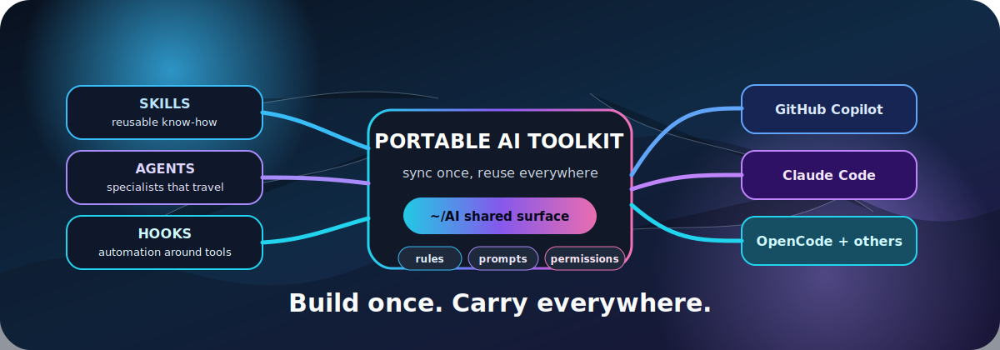

# AI Repository



Make the work you have invested in **skills and agents** portable across AI clients, machines, and repos.

This is for people who are tired of rebuilding the same AI workflows in Copilot, Claude Code, OpenCode, and project-local folders. Keep your real skill sources in repos you own, sync them into one shared toolkit, and point each client at the same reusable capabilities.

## Quick Start

```bash
# 0. Install the required YAML parser.
brew install yq

# 1. Clone and initialize the toolkit without fetching external skills yet.
git clone git@github.com:bobthearsonist/ai.git ~/AI
cd ~/AI
./setup.sh --skip-sync

# 2. Register your existing skills repo in local.yaml.
# Edit collections.personal.path and the skills list.
${EDITOR:-vi} local.yaml

# 3. Sync local collections and git-managed skills into ~/AI/skills.
./scripts/sync.sh

# 4. Wire common clients to the shared skill output.
mkdir -p ~/.claude ~/.copilot
[ -e ~/.claude/CLAUDE.md ] || ln -s ~/AI/AGENTS.md ~/.claude/CLAUDE.md
[ -e ~/.claude/skills ] || ln -s ~/AI/skills ~/.claude/skills
[ -e ~/.claude/agents ] || ln -s ~/AI/agents ~/.claude/agents
[ -e ~/.copilot/skills ] || ln -s ~/AI/skills ~/.copilot/skills

# 5. Verify dependencies, collections, symlinks, and client wiring.
./scripts/doctor.sh
```

`setup.sh --skip-sync` gives you a chance to edit `local.yaml` before fetching external skills. Run `./setup.sh` without that flag if you want setup to sync immediately.

## Need More Detail?

- **Install the toolkit on a machine:** [Getting started](docs/getting-started.md)
- **Bring existing local skills under this workflow:** [Migration guide](docs/migration-guide.md)
- **Configure `local.yaml` collections:** [Collections reference](docs/collections.md)
- **Point AI clients at synced skills:** [Client support](docs/client-support.md)
- **Add or improve a shared skill:** [Contributing](CONTRIBUTING.md)
- **Understand the repo layout:** [Skills and agents architecture](docs/skills-agents-architecture.md)

## What Lives Here

This repo is a portability layer, not a dumping ground. It keeps the shared contract in one place and lets the actual skill sources live where they make sense.

**Source of truth:** `AGENTS.md` for shared instructions, `external-skills.yaml` for repo-managed skills, `local.yaml.example` for the collection template, `rules/` for tiny constraints, `prompts/` for reusable prompt text, `permissions/permissions.yaml` for client permissions, and `setup.sh` plus `scripts/` for automation.

**Local machine config:** `local.yaml` is gitignored and points at your personal, work, or team skill repos. This is where paths differ by machine.

**Generated/synced output:** `skills/`, `agents/`, and other collection links are produced by `scripts/sync.sh`. Do not make personal skills there directly; edit the source repo and sync again.

## Core Workflow

1. Keep your real skill source in a repo you own, such as `~/Repositories/my-ai-skills/skills/<name>/SKILL.md`.
2. Register that repo in `local.yaml` under `collections`.
3. Run `./scripts/sync.sh`.
4. Configure your AI clients to read `~/AI/skills` and `~/AI/agents`.
5. Share broadly useful improvements by PR rather than editing synced output.

See the [migration guide](docs/migration-guide.md) for the full path from existing local skills to shared project or team skills.

## Repository Model

This repo separates source-of-truth content from generated/synced output:

- **Internal skills** live in this repo and are listed in `external-skills.yaml` with `type: internal`.
- **Git-fetched skills** are listed in `external-skills.yaml` with `type: git`; `sync.sh` copies them into `skills/`.
- **Personal or work skills** live in your own repos and are listed in `local.yaml`; `sync.sh` symlinks them into `skills/`.
- **Project-shared skills** should live in the project repo that needs them, usually under `.github/skills/` or `.claude/skills/`, when they are only useful to that project.

## Contributing

Start with [CONTRIBUTING.md](CONTRIBUTING.md). In short: update source files, not synced output; keep skills focused and triggerable; include verification steps; and run `./scripts/doctor.sh` before opening a PR.

## Related Docs

- [Getting started](docs/getting-started.md)
- [Migration guide](docs/migration-guide.md)
- [Collections reference](docs/collections.md)
- [Client support](docs/client-support.md)
- [Skills and agents architecture](docs/skills-agents-architecture.md)
- [Context Lens setup](docs/context-lens-setup.md)
