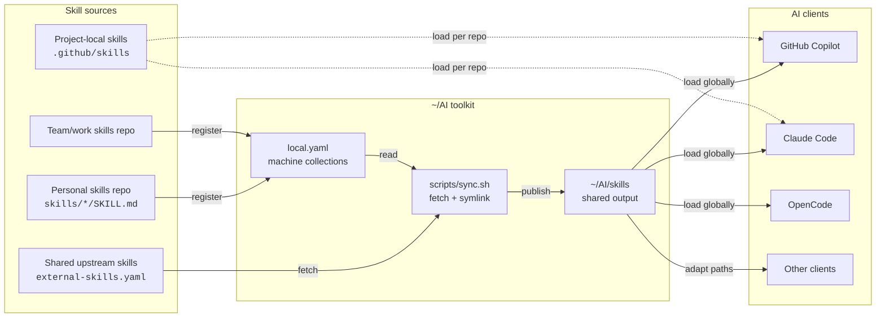

# Skills and Agents Architecture

This repo keeps reusable AI behavior in small, portable components.

## Component Types

- **Skill:** use when the content has procedures, decision points, or substantial domain knowledge. Source format: directory with `SKILL.md`.
- **Agent:** use when you need a named specialist persona that can load skills or tools. Source format: Markdown file with frontmatter.
- **Rule:** use when the guidance is a short constraint, usually under 10 lines. Source format: plain Markdown.
- **Prompt:** use when you need reusable text that can be copied or referenced. Source format: plain Markdown.

## Skill Sources

- **Internal repo skill:** configured in `external-skills.yaml` with `type: internal`; tracked directly in this repo.
- **Third-party git skill:** configured in `external-skills.yaml` with `type: git`; copied from `.external-cache`.
- **Personal/work skill:** configured in a `local.yaml` collection; symlinked into `skills/`.
- **Project-local skill:** configured in the project repo; read directly by the client.

## Portability Flow



## Directory Layout

```text
~/AI/
├── AGENTS.md
├── external-skills.yaml
├── local.yaml
├── local.yaml.example
├── scripts/
│   ├── sync.sh
│   └── doctor.sh
├── skills/
├── agents/
├── rules/
├── prompts/
└── permissions/
```

`skills/` and `agents/` are mostly sync output and are gitignored. Add shared repo-owned skills with `git add -f` only when they are intentionally internal toolkit skills.

## Sync Flow

```text
external-skills.yaml git entries -> .external-cache -> skills/<name>
external-skills.yaml internal entries -> tracked skills/<name>
local.yaml collections -> symlinks in skills/, agents/, hooks/, or root links
```

`scripts/sync.sh` does not configure AI clients. It only prepares this repo's shared paths. See [Client support](client-support.md) for client wiring.

For skill design and quality guidance, use the `skill-creator`, `skill-design`, and `ai-repo-management` skills as the source of truth.

## Agent Format

Top-level agents use a small frontmatter surface for broad client compatibility:

```yaml
---
name: skill-builder
description: Converts memory observations into reusable skills.
---
```

Client-specific agent formats can live under subdirectories when needed.
